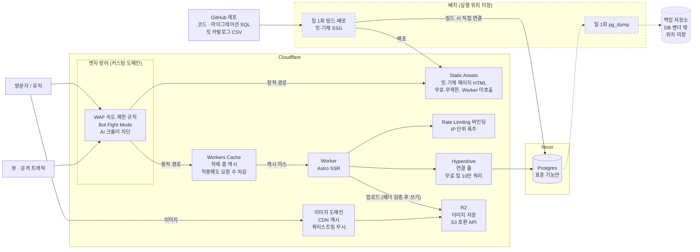
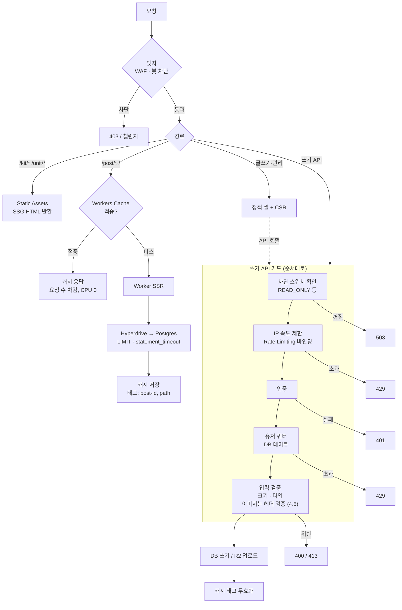
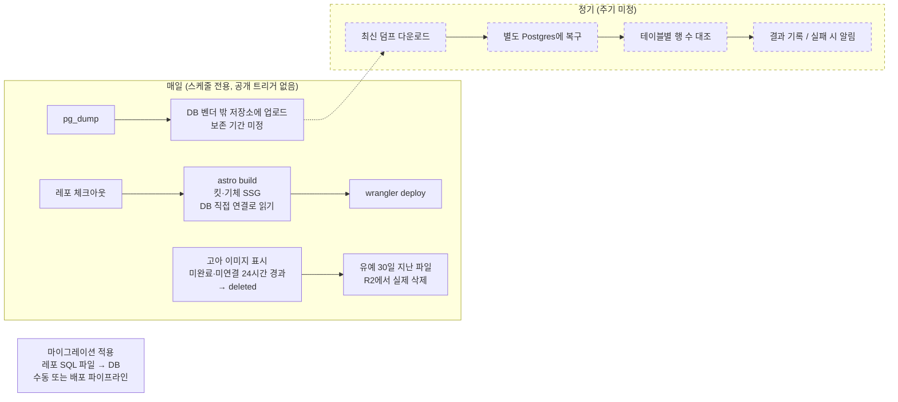
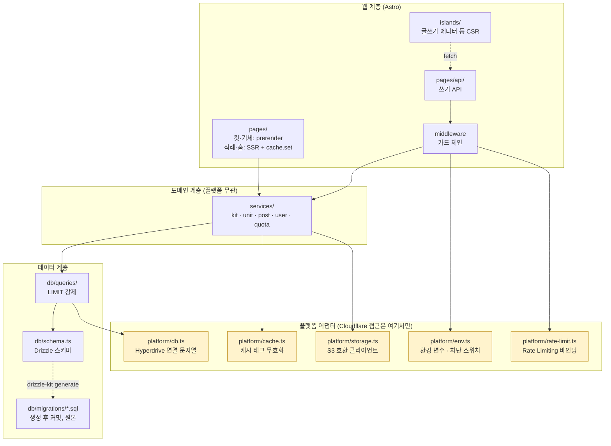
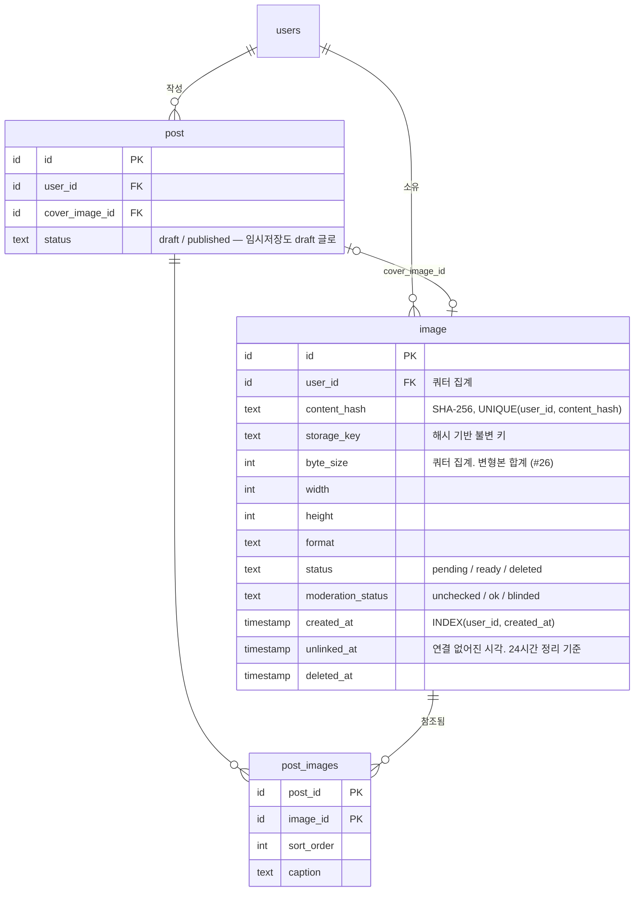
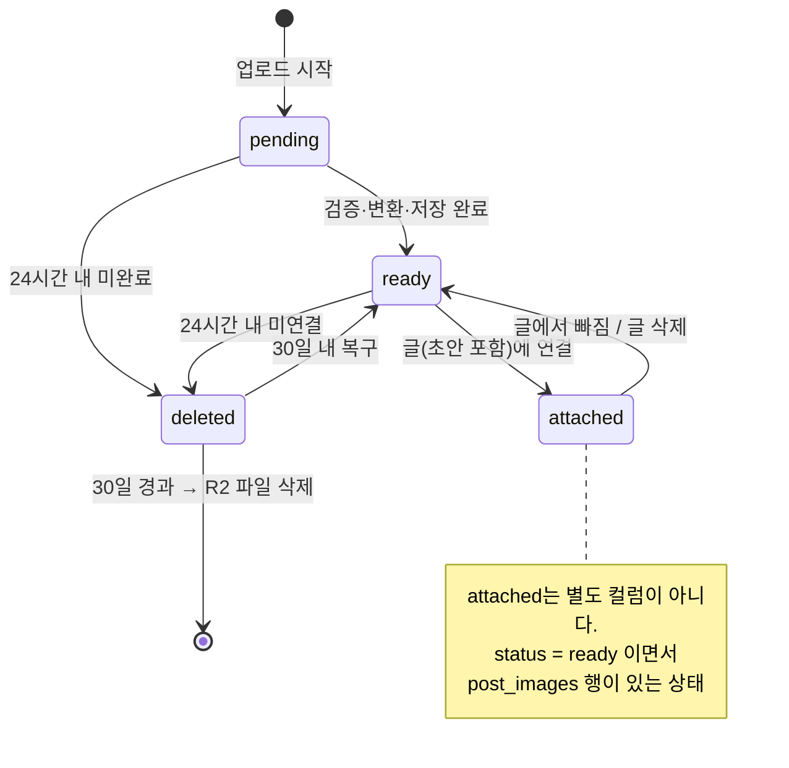
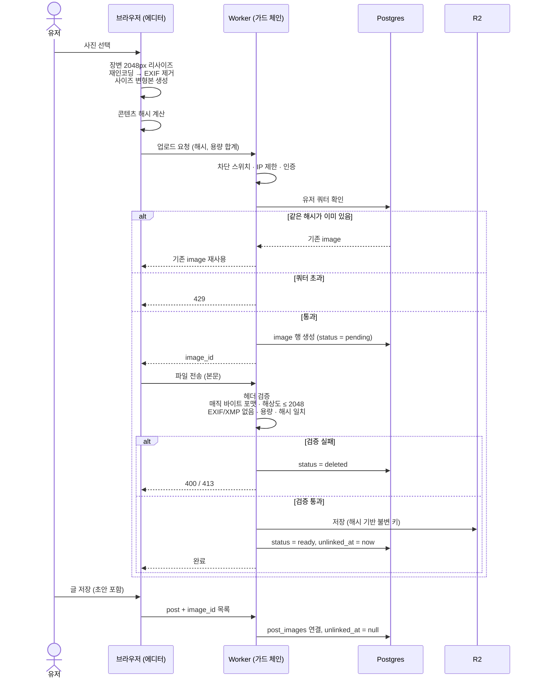

# G-MOIM 아키텍처 v1

인프라 구성과 코드 구조를 그림으로 남긴다. 검토·수정할 때 이 문서부터 본다.

작성 2026-09-13 · 기준 결정 #13, #17~#26

---

## 읽는 법

| 표시 | 뜻 |
|---|---|
| 실선 상자·화살표 | 확정된 결정에 근거 |
| 점선 상자·화살표 | **미정.** 해당 설계 노드에서 결정 예정 |
| `[초안]` | 결정에서 끌어낸 제안. 구현 시작 전에 검토 |

**이 문서는 결정을 만들지 않는다.** 결정은 `docs/STATUS.md`에 먼저 기록하고, 여기는 그림으로 옮긴다. 둘이 어긋나면 STATUS가 맞다.

**갱신 규칙** — 인프라 구성요소나 코드 계층이 바뀌는 결정이 나면 이 문서를 고친다. 구조가 크게 바뀌면 v2 파일을 새로 만든다.

---

## 1. 인프라 구성도



### 구성요소 표

| 구성요소 | 역할 | 근거 결정 | 무료 한도 / 비용 주의 |
|---|---|---|---|
| WAF · Bot Fight Mode | 엣지에서 봇·폭주 차단 | #20 | 속도 제한 규칙 무료 1개 |
| Static Assets | 킷·기체 정적 페이지 | #13, #18 | 파일 2만 개/배포 |
| Workers Cache | 작례·홈 SSR 결과 캐시, 태그 무효화 | #18 | **적중도 요청 수 차감** |
| Worker (Astro) | SSR, API | #17 | 일 10만 요청, 요청당 CPU 10ms |
| Rate Limiting 바인딩 | IP 단위 초 단위 제한 | #23 | 부정확 (위치별 카운트) |
| Hyperdrive | Worker → Postgres 연결 풀 | #22 | 일 10만 쿼리 |
| Neon Postgres | 핵심 데이터 | 부록 C, #19 | 0.5GB, 월 100 CU-hour. 초과 시 정지(무과금) |
| R2 | 이미지 원본 대신 변환본 저장 | 부록 C | **무료 플랜에서도 초과분 과금** |
| 배치 | 일 1회 SSG 재빌드, DB 백업 | #18, #19 | 실행 위치 미정 (GitHub Actions 또는 Workers Builds) |
| 백업 저장소 | DB 덤프 보관 | #19 | 위치 미정. **Neon 밖**이어야 함 |

---

## 2. 페이지별 요청 흐름



**가드 순서의 이유** — 싼 검사를 먼저 한다. 스위치 확인과 IP 제한은 DB에 닿지 않는다. 쿼터 확인부터 DB를 쓰므로 인증된 요청만 도달하게 한다. 크기·타입 검증은 스토리지 쓰기보다 반드시 앞(#20).

---

## 3. 배치 파이프라인



- 빌드는 Hyperdrive가 아니라 **DB 직접 연결**로 읽는다. Hyperdrive는 Worker 런타임용이다
- 킷 페이지가 늘어나도 빌드는 하루 1회라 빌드 한도(Workers Builds 월 3,000분 등)는 병목이 아니다
- 복구 훈련은 #19의 필수 요건. 자동화 방식은 미정
- 고아 이미지 정리는 #25. 상세는 4.4

---

## 4. 코드 아키텍처 `[초안]`

### 4.1 계층



### 4.2 의존 규칙

| 규칙 | 근거 |
|---|---|
| `platform/` 밖에서 `cloudflare:*` 모듈, 바인딩(`env.*`)을 직접 쓰지 않는다 | #19 |
| `services/`는 Astro·Cloudflare를 모른다. 순수 TypeScript | #19 |
| DB 접근은 `db/queries/`를 통한다. 목록 쿼리는 `LIMIT` 필수 | #20 |
| 스키마 변경은 `drizzle-kit generate` → SQL 파일 커밋 → 적용. `drizzle-kit push` 금지 | #21 |
| 쓰기 API는 전부 `middleware` 가드 체인을 통과한다 | #20 |
| IP 단위 제한은 `platform/rate-limit.ts`, 유저 쿼터는 `services/quota` + DB | #23 |

규칙 위반은 나중에 린트(import 제한)로 막는 것을 검토한다.

### 4.3 디렉터리 `[초안]`

```text
G-MOIM/
├── src/
│   ├── pages/            라우트. 킷·기체 prerender, 작례 SSR
│   │   └── api/          쓰기 API
│   ├── middleware.ts     가드 체인 (스위치 → IP 제한 → 인증 → 쿼터 → 검증)
│   ├── islands/          CSR 컴포넌트 (에디터 등)
│   ├── styles/           Tailwind 진입점 + 토큰(CSS 변수). 스킨은 토큰 교체 (#27)
│   ├── services/         도메인 로직. 플랫폼 무관
│   ├── db/
│   │   ├── schema.ts     Drizzle 스키마
│   │   ├── queries/      쿼리 함수
│   │   └── migrations/   생성된 SQL. 원본
│   └── platform/         Cloudflare 접근 유일 지점
├── scripts/              배치: 백업, 복구 훈련, 카탈로그 적재
├── data/                 킷 카탈로그 CSV (기존)
├── docs/                 (기존)
├── astro.config.mjs
├── drizzle.config.ts
└── wrangler.jsonc        workers_dev: false, cache.enabled, limits
```

### 4.4 이미지 데이터 모델과 수명 (결정 #24, #25)

사진이 많은 서비스라 이미지를 **게시물에 종속시키지 않고 유저 소유 자산**으로 둔다. 파일은 R2, DB에는 메타데이터만.



갤(MVP 제외)이 생기면 `gal_post_images`가 같은 `image`를 참조한다. 복제하지 않는다.

`post.status`(draft / published)는 #25의 전제 조건으로 넣은 것이다. 게시 상태 모델 전체는 에디터 설계(1.1.3)에서 확정한다.

#### 수명 주기



| 규칙 | 이유 |
|---|---|
| 업로드는 `pending` 행을 먼저 만들고 시작 | 쿼터를 업로드 전에 확인하고, 실패한 업로드도 추적 |
| 미연결 24시간이면 삭제 표시 | 업로드만 하고 글을 안 쓰는 저장소 채우기 차단 (#20) |
| **임시저장은 반드시 draft 글로 서버에 저장** | 브라우저에만 임시저장하면 24시간 뒤 사진이 지워진다 |
| 글에서 빠진 사진은 `unlinked_at`을 기록해 24시간 시계 시작. 다시 연결되면 `unlinked_at = null` | 수정 중 사진을 뺐다가 되돌리는 경우를 흡수. 업로드 시각(`created_at`)으로는 판단 불가 |
| 정리 대상 조건: `status=ready` AND 연결 0건 AND `unlinked_at < now - 24h` | 업로드 직후에도 `unlinked_at`을 기록해 같은 조건으로 처리 |
| 파일 실제 삭제는 30일 유예 후 | 실수·오판 복구 |
| 같은 유저가 같은 파일 재업로드 → 기존 행 재사용 | 반복 업로드로 쿼터·저장소 소모 차단 |
| 유저 간 중복 제거는 하지 않음 | 삭제 시 참조 관리가 복잡해지는 데 비해 절약이 작다 |

### 4.5 이미지 업로드 흐름 (결정 #26)

변환은 **브라우저**가 하고, 서버는 **믿지 않고 검증만** 한다.



| 규칙 | 이유 |
|---|---|
| 서버는 **디코딩하지 않고 헤더만** 읽는다 | 무료 Worker CPU 10ms·메모리 128MB 안에서 가능한 유일한 방식 |
| 검증은 R2 쓰기 **전** | 규칙 위반 파일이 한 번도 저장되지 않게 (#20) |
| R2 직접 서명 URL 업로드 경로를 만들지 않는다 | 검증을 우회하는 경로가 생긴다 |
| 해시는 서버가 받은 바이트로 다시 계산해 대조 | 클라이언트가 보낸 해시를 믿지 않는다 |
| 변형본도 같은 검증을 통과해야 한다 | 썸네일 자리에 원본을 끼워 넣는 우회 차단 |

**보조 경로** — 화질·HEIC·브라우저 호환 문제가 실제로 생기면 Cloudflare Images 서버 변환을 `platform/` 어댑터 뒤에 보조로 붙인다. 무료 월 5,000회 한도라 기본 경로로 쓰지 않는다.

---

## 5. 이식성 교체 지점

"이 구성요소가 막히면 무엇을 바꾸나." #19.

| 구성요소 | 현재 | 막혔을 때 바꿀 곳 | 대안 예시 | 데이터 이관 |
|---|---|---|---|---|
| DB | Neon | `platform/db.ts` 연결 문자열 | Supabase, RDS, 자체 Postgres | **벤더 밖 백업**에서 복구 |
| DB 연결 풀 | Hyperdrive | `platform/db.ts` | 표준 드라이버 직접 연결, PgBouncer | 없음 |
| 컴퓨트 | Workers | Astro 어댑터 교체, `platform/` 전체 | Node 어댑터 + VPS, Vercel, Netlify | 없음 |
| 정적 호스팅 | Static Assets | 배포 대상 | 아무 정적 호스팅 + CDN | 빌드 산출물 재배포 |
| SSR 캐시 | Workers Cache | `platform/cache.ts` | CDN 캐시 헤더, Varnish | 없음 (재생성) |
| IP 속도 제한 | Rate Limiting 바인딩 | `platform/rate-limit.ts` | 리버스 프록시 제한, Redis | 없음 |
| 이미지 | R2 | `platform/storage.ts` 엔드포인트·키 | S3, B2, MinIO | S3 호환 동기화 (용량에 비례해 시간 소요, 미계산) |
| 엣지 방어 | Cloudflare WAF | DNS·프록시 설정 | 다른 CDN WAF | 없음. 규칙 재작성 |
| 스키마 | Drizzle | 쿼리 코드 | Kysely, 생SQL | 없음. SQL 마이그레이션 파일이 원본 |

---

## 6. 미정 항목

그림에서 점선으로 표시한 부분. 결정되면 이 문서를 갱신한다.

| 항목 | 설계 노드 | 영향 받는 그림 |
|---|---|---|
| 사이즈 변형 프리셋 목록 (썸네일 크기 등) | 1.1.3 | 4.5 |
| Safari 저장 포맷 (JPEG 허용 / WebP 인코더 라이브러리) | 1.1.3 | 4.5 |
| 업로드 용량 상한, 유저 쿼터 수치 | 1.1.3 | 2, 4.5 |
| 게시 상태 모델 전체 (draft 외 예약·비공개 등) | 1.1.3 | 4.4 |
| 인증 방식 (벤더 인증 여부) | 4.6 | 2, 4 |
| 배치 실행 위치 (GitHub Actions / Workers Builds) | 미배정 | 1, 3 |
| DB 백업 저장소와 보존 기간 | 미배정 (#19) | 1, 3 |
| 복구 훈련 주기와 자동화 | 미배정 (#19) | 3 |
| 커스텀 도메인 | 인프라 7장 | 1 |
